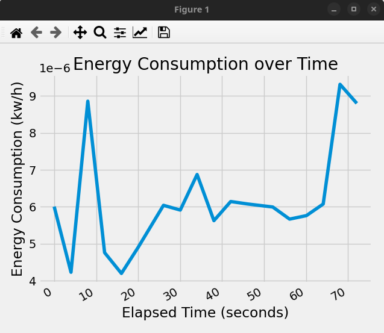

# Computer Energy and Data Consumption Tracker

This repository provides tools for tracking energy consumption and data consumption on a single computer. It utilizes various libraries to monitor and measure the energy usage of the CPU and track data consumption on the system.

## Computer Hardware

### CPU

- Model name: Intel(R) Core(TM) i7-8650U CPU @ 1.90GHz
- CPU family: 6
- Model: 142
- Thread(s) per core: 2
- Core(s) per socket: 4
- Size: 2975MHz
- Capacity: 4200 MHz

### GPU

- Description: VGA compatible controller
- Product: UHD Graphics 620
- Vendor: Intel Corporation
- Version: 07
- Width: 64 bits
- Clock: 33MHz

## How to Run the Code

1. Set up the Chrome Extension and WebSocketServer beforehand.
2. Before running the code, ensure that the required dependencies are installed:
  ```
  pip install -r requirements.txt
  ```
  - Refer [here](https://github.com/fenrus75/powertop) for PowerTOP installation
3. Execute the following command to obtain an overall network usage:
  ```
  python data_consumption.py
  ```
4. Execute the following command to get insights into the power consumption of the local machine:
  ```
  python pyjoules_energy_consumption.py
  ```
5. Refer to [here](#in-cloud-energy-consumption) for In-Cloud Energy Consumption tracking


## Energy Consumption Overview

The Energy Consumer Tracker is a Python-based tool that allows you to monitor and track your device's energy consumption using the RAPL (Running Average Power Limit) power meter from Intel. It provides real-time insights into the energy consumption of components such as the CPU, integrated GPU, and DRAM.

The tool utilizes the **pyJoules** library, a Python library that allows you to measure and monitor energy consumption on systems with Intel RAPL support. By sampling the energy usage every 30 seconds, it records the data and stores it in a CSV file. Additionally, it calculates the percentage change in energy consumption between consecutive 30-second intervals, providing a measure of energy consumption fluctuations.

The Energy Consumer Tracker also leverages the **PowerTOP** (Linux Tool) utility to collect energy consumption reports concurrently. By comparing the recorded data with the expected energy consumption, it identifies any unexpected increases in power consumption. In such cases, the tool retrieves the top 10 Power Consuming Processes' id (PID) using the PowerTOP library and presents them to the user using the Python library **psutil**. This detailed information empowers users to take necessary actions, such as terminating or killing unnecessary processes, to mitigate excessive power usage.

Furthermore, the Energy Consumer Tracker offers visualization capabilities to present the power consumption results obtained from the pyJoules library. This visualization provides users with a clear and intuitive representation of energy consumption trends over time.

#### pyJoules Example output

```
begin timestamp : 1685697444.8609605; tag : foo; duration : 4.584830045700073; package_0 : 11390718.0; dram_0 : 3499747.0; core_0 : 1680782.0; uncore_0 : 138610.0
```

- package_0: This refers to the energy consumption of the entire package, which typically includes the CPU cores, integrated GPU, and other components on the chip. It represents the total power consumed by the processor package.

- dram_0: This represents the energy consumption of the Dynamic Random Access Memory (DRAM), which is the primary memory used by the system. It indicates the power consumed by the memory modules and controllers.

- core_0: This denotes the energy consumption of the CPU cores. It represents the power consumed by the processing units (cores) of the CPU during the execution of your code.

- uncore_0: This refers to the energy consumption of the uncore components. The uncore includes parts of the CPU that are not directly related to the cores, such as the memory controller, cache hierarchy, and other on-chip components. It represents the power consumed by these components.

The output displays the energy measurements for the specified duration. The values for package_0, dram_0, core_0, and uncore_0 are given in mikrojoules (mJ) and indicate the total energy consumed by each component during the execution of the function.

<p align="center">
  
</p>


## Features
-   Monitoring and tracking of energy consumption using the RAPL power meter.
-   Calculation of energy consumption for CPU, integrated GPU, and DRAM.
-   Recording and storage of energy consumption data in a CSV file at 30-second intervals.
-   Calculation of percentage changes in energy consumption between consecutive intervals.
-   Concurrent execution of PowerTOP utility for collecting energy consumption reports.
-   Identification of top 10 power-consuming processes using psutil library.
-   Visualization of power consumption results from PyJoules library.

## Future Enhancements

-   Advanced analytics and insights on energy consumption patterns.
-   Real-time alerts and notifications for significant changes in power consumption.
-   Integration with power management systems for automated power optimization.
-   Compatibility with virtual and physical machines for versatile energy tracking capabilities.


# In-Cloud Energy Consumption

## Steps

- Create a Google Cloud Virtual Machine Instance.
- Create Service Account Credentials to reach out Monitoring information of your VM
    - Go to the Google Cloud Console: https://console.cloud.google.com/
    - Navigate to "IAM & Admin" > "Service accounts" in the left sidebar.
    - Create a new service account and grant it the necessary permissions for accessing Google Cloud Monitoring data.
    - Download the JSON key file for the service account.
- Set the GOOGLE_APPLICATION_CREDENTIALS Environment Variable 
    - To tell the Google Cloud client libraries where to find your credentials, set the GOOGLE_APPLICATION_CREDENTIALS environment variable to the path of the downloaded JSON key file:
    ```
    export GOOGLE_APPLICATION_CREDENTIALS="/path/to/your/keyfile.json"
    ```
- Create a python virtual environment and install google-cloud-monitoring tool
    - python -m venv cloud_consumption_venv
    - source cloud_consumption_venv/bin/activate
    - pip install google-cloud-monitoring
